# 🐣 S1 | Prog: Workshop

# # Workshop prog algo - Chloé CHABAUD

Exercice n°1 : Ne garder que le vert
Mettre le bleu et le rouge à 0.

Exercice n°2 : Échanger les canaux
Avec swap.

Exercice n°3 : Noir et blanc
Grace à la formule de luminance (rouge0.3 + vert0.59 + bleu\*0.11)

Exercice n°4 : Négatif
calcul : 1-couleur, pour avoir l'inverse.

Exercice n°5 : Dégradé
Equivalent de map en Processing puis (gris, gris, gris) pour les couleurs.
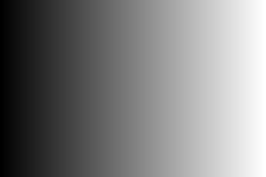

Exercice n°6 : Miroir
Avec fonction swap et la formule pixel=image.width() - (1+x)

## Exercice n°7 : Bruits

nbr de pixels bruités aléatoires (entre 1 et la moitié du nbr de pixels total). Pixels choisis aléatoirement et nouvelle couleur aléatoire

## Exercice n°8 : Rotation 90°

J'ai eu du mal à comprendre quelle formule utiliser. Mais j'avais compris qu'il fallait inversrer les axes x et y. Puis j'ai remarqué qu'il fallait faire "miroir" sur le nouvel axe des x. Ainsi j'ai obtenue le résultat suivant:

## Exercice n°9 : RGB Split

Grâce aux indications j'ai éviter le pièges et ai créé une nouvelle image.

J'ai d'abord mis un décalagé de 1px, mais le résultat ne se voyait pas. J'ai alors augmenter à 50px.
J'ai ensuite eu du mal à gérer les débordement.
J'ai donc calculé en amont la somme des pixels avec décalage, puis en fonction du débordement ou pas, changer les affectation au nouveau pixel.

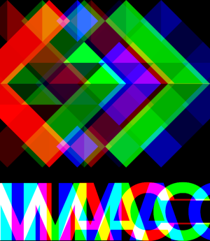

## Exercice n°10 : Luminosité

Puissance 3 pour assombrir et puissance 0,2 pour éclairer.

## Exercice n°11 : Disque

On a un cercle qui a pour centre le point [width/2, height/2] et pour rayon R.
L'équation caractéritique du cercle est :

> (x−cx)² + (y−cy)² ≤ R²

Si (x−cx)² + (y−cy)² < R² alors le point est à l’intérieur du disque.
Si (x−cx)² + (y−cy)² = R² alors le point est sur le contour
Si (x−cx)² + (y−cy)² > R² alors le point est à l’extérieur

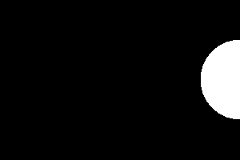

### Partie 2 : cercle

Pour le cercle, j'ai simplement ajouté une condition : le point doit être a l'exterieur du cercle de rayon R-épaisseur ( avec R rayon du disque précédent).

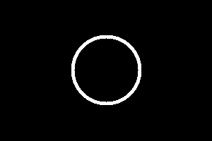

### Partie 2 : Animation

J'au créé 2à image pour faire ce GIF.
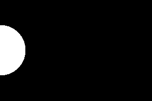

### Partie 3 : Rosace

Transformation coordonnée cartésiens en polaire avec cos et sin
Puis j'ai divisé mon cercle (2\*pi) en le nombre de cercle que l'on veut. Puis pr chaque itération je me ballade sur le cercle trigo
Au début, j'avais mis mon angle theta en int au lieu de float donc cela a crééer ce léger décalage :
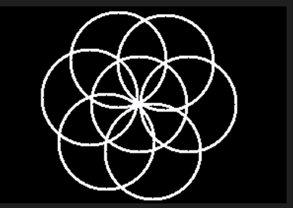
Avec rectification:
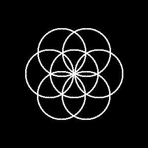

## Exercice n°12 : Mosaïque

J'ai utilisé le modulo pour "me ballader" sur l'image de base. Ainsi tout les "longueur de l'image" je reviens au début et je répète le pixel sur la nouvelle image
J'ai fait un premier test où la fenêtre n'étais pas assez grande donc je ne voyait pas les répetitons. Après avoir (enfin) compris j'ai augmenté.

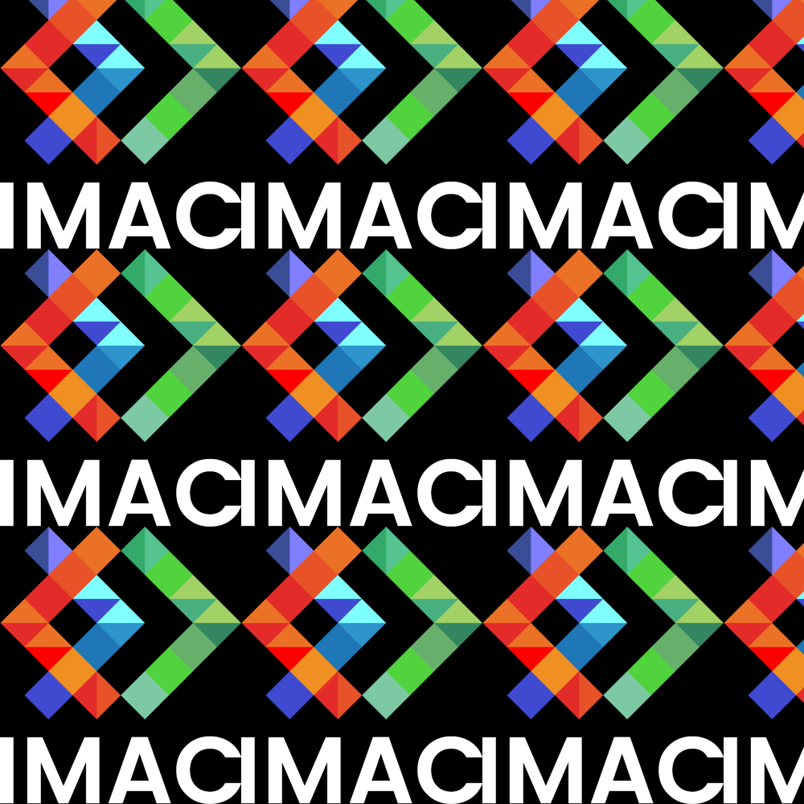

### Partie 2 : Mosaïque inversée

J'ai commencé par définir 4 les formes possibles de l'image
(inversé selon x ou pas ET/OU inversé selon axe y)

Il m'a suffit ensuite de le retranscrire en code pour obtenir le résultat :

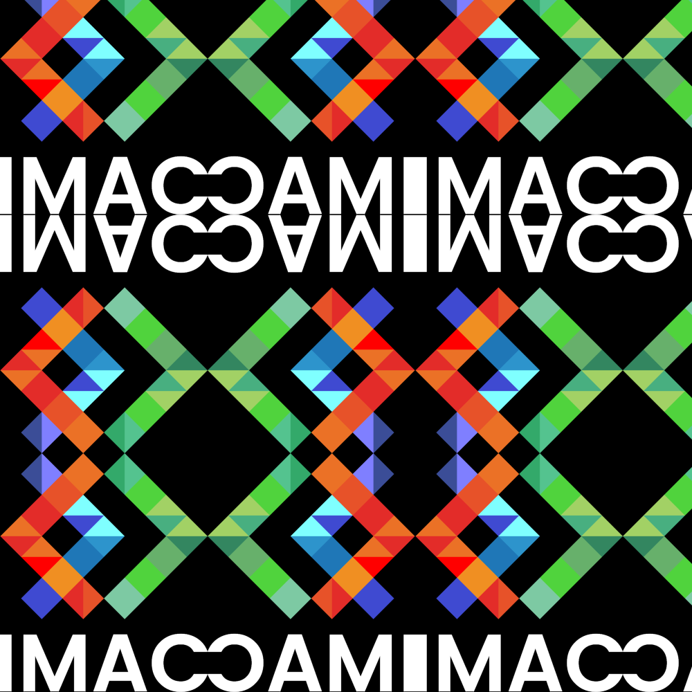

## Exercice n°13 : Glitch

Le seul problème que j'ai rencontré est qu'en laissant une longueur et une largeur aléatoire aux rectangles, j'avais parfois un dépassement.
J'ai donc ajouté des conditions au moment des choix aléatoires : Choisir le minimum entre le nbr aléatoire et l'espace qu'il reste avant de dépasser pour un des deux rectangles.

## Exercice n°14 : Tri pixels

J'ai vraiment galéré à trouver la logique. Mais grace à l'aide de mes camardes (Agathe enfaite) j'ai pu avancer.

## Exercice n°15 : Fractale

J'ai rencontré des difficultés pour modifier les coordonnées x et y pour les avoir dans les intervalles pertinents.
Puis, j'ai rencontré le problème des couleurs, je n'ai pas de nuances de gris, que de noirs et du blanc

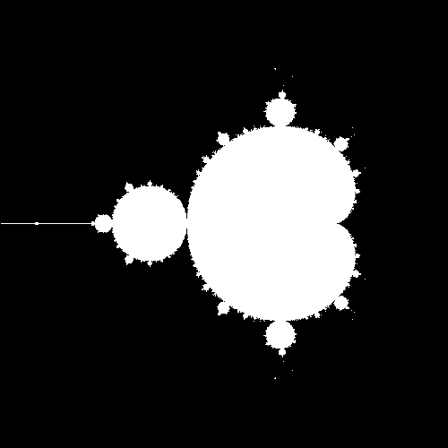

## Exercice n°16 : Dégradé Couleur 1

J'ai repris le code du D2gardé noir et blanc. J'ai ensuite utilisé la fonction qui permettait d'avoir le pourcentage de noir, pour avoir un pourcentage en paramètre de la fct mix.
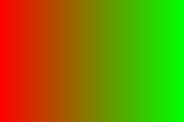

## Exercice n°16 : Dégradé Couleur LAB

J'ai eu beaucoup plus de difficulté avec cette parrie. Je mélangeait les types ( image.pixel =! sil::vec3, image.pixel(x,y)=! image.pixel(x,y).r etc...)
J'ai ensuite eu du mal à comprendre dans quel ordre appliqué les transformation, mais grace à mes camarades j'ai réussi (sRGB->lin->OKLab->lin->sRGB).
Je ne connaissais pas la fonction glm::clamp qui permettait d'atterrir dans un intervalle définie, ce qui m'a bloquée un moment.
Enfin, la fonction mix ne fonctionne que pour des ouleur en sRGB donc il a fallu l'écrire à la main.
Finalement j'ai réussi à obtenir un meilleur dégradé garce à cette méthode:

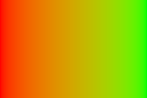

## Exercice n°18 : Normalisation de l'histogramme

Mon code ne changeait pas l'image au début car je modifiait les 3 composante r,g,b en même temps (je modifisais image.pixel(x,y) et non pas chacune de ses 3 composantes). Après réctification j'obtient, à partir de l'image faible cobtraste :
AVANT

APRES

## Exercice n°19 : Vortex

Au début je faisais les changements sur l'image actuelle.
Une fois que j'ai compris qu'il était nécessaire de d'utiliser une nouvelle image, j'ai parcouru l'image de base, calculer sa distance avec son centre pour chacun pixel, puis calcuelr un angle en fonction, pour end éduire une nouvelle psoition. Je copie ensuite le picel de base à la nouvelle position calculée sur la nouvelle image.
Pour calculer l'angle j'ai divisé la disance par la distance max ( la diagonal avec pythagore), puis j'ai multiplié (en faisant des essais) par un coeffcient.
J'obtient ainsi :

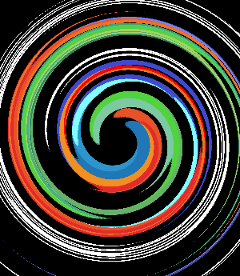

## Exercice n°15 : Convolution

J'ai d'abord essayer de modifier l'image passer en paramêtre, ce qui ne permettait pas d'obtenir le résultat souhaité. Ensuite j'ai eu du mal à comprendre pq quand j'affectais la nouvelle couleur au pixel (après application du karnel ça ne fonctionnait pas). J'ai fini par comprendre que c'était un soucis de valeur. Je savais que je devais utilsier clamp pour limiter une valeur à une plage donnée. Avec l'aide de mes camardes j'ai pu régler cette erreur.
L'effet flou est léger mais je n'ai pas pu tester de changer de Kernel.
J'ai mis un tab kernel à passer en paramètre afin de faciliter la suite des exercices

## Exercice n°16 : Sharpen, Emboss, Outline

Grâce au code précédent, en définissant d'autre kernel on obtient les résultats suivants

## Exercice n°17: Filtre séparable

J'ai repris mon code précédent, mais au lieu d'avoir un kernel, j'ai créé deux listes (une qui "passe en horizontale, l'autre en verticale). Je me suis emmélée entre l'image de base, l'image intermédiaire, et l'image finale.
Je n'avais pas fait attention mais le kernel doit être centré sur le pixel en question, sinon on floute seulement vers la droite et le bas. J'ai donc eu ce premier résultat que j'ai eu :

Puis, j'avais un problème dans mes boucles (j'avais mis i<=16 au lieu de <16) il y avait un débordement et j'avais un résultat trop foncé
: 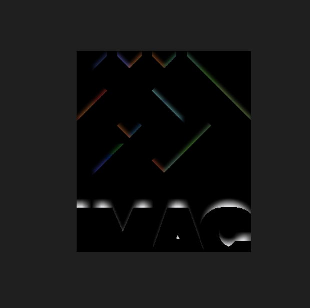
Mais finalement, j'ai fini par avoir un résultat (rapide)

## Exercice n°17: Différence de Gaussienne

J'avais oublié de passer par des références (oups...)
J'avais aps compris qu'il fallait une étape en plus après avoir passé les pixels (issus de la soustraction) en gris. J'ai donc obtenu d'abord ce résultat...

de convertir ma soustraction (utiliser clamp )
J'ai tester plusieurs valeurs pour choisir quel pixels mettre en blanc ou en noir, le coefficent 0.15 semblait être le meilleur.
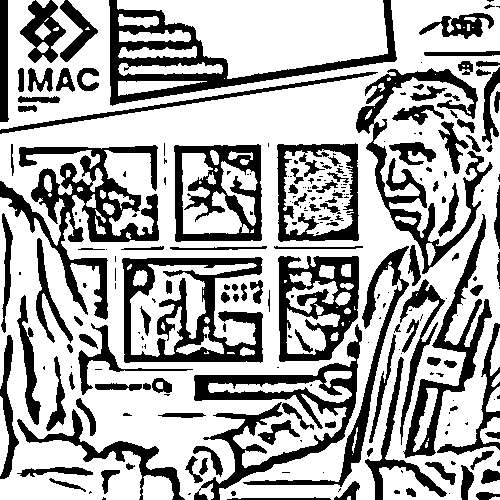
